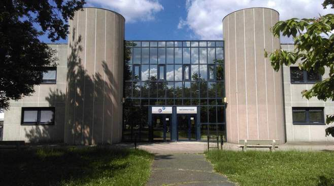
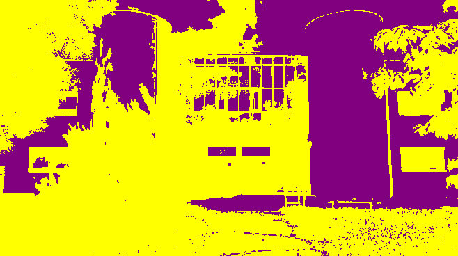
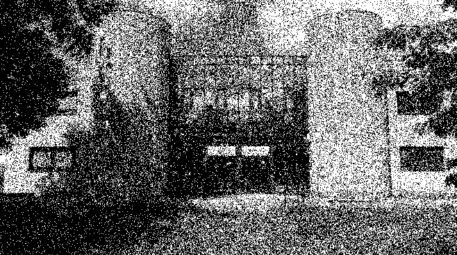
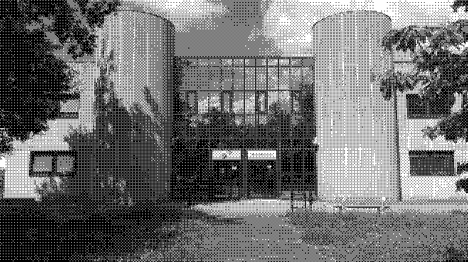

# Rust-Maridat-Lebeaupin

## Partie 1 - La bibliothèque image

### Question 1


Commande pour créer un projet Cargo :

```sh
cargo init ditherpunk
```

Pour ajouter une dépendance sur la bibliothèque image :

```sh
cargo add image
```

Modifier la version dans le fichier `Cargo.toml` :
```toml
[dependencies]
image = "0.24"
```


### Question 2

Pour ouvrir une image depuis un fichier, on utilise la fonction `open`. Pour obtenir une image en mode `RGB8`, on peut utiliser la méthode `to_rgb8` de l'objet `DynamicImage`.

	
### Question 3

Si l'image de départ avait un canal alpha, celui-ci sera perdu lors de la sauvegarde.



### Question 4

Pour savoir trouver la couleur d'un pixel, voici la commande utilisé :
```rs
println!("Le pixel en 32, 52 a pour couleur {:?}", img.get_pixel(32, 52));
```

Résultat :
```
Le pixel en 32, 52 a pour couleur Rgb([8, 8, 8])
```

### Question 5

Pour passer un pixel sur deux d’une image en blanc. Il faut parcourir tous les pixels de l'image :
```rs
for (x, y, color) in img.enumerate_pixels_mut() {
        if (x + y) % 2 == 0 {
            *color = Rgb([255, 255, 255]) // pour mettre la couleur du pixel en blanc
        }
    }
```


L'image reste tout de même reconnaissable, on dirait qu'un filtre blanc est appliqué.

## Partie 2 - Passage en monochrome par seuillage

### Question 6

La commande pour récupérer la luminosité d'un pixel utilise la méthode to_luma fournie par le trait Pixel de la bibliothèque image :
```rs
let luminosity = pixel.to_luma()[0];
```

Source :

```
https://docs.rs/image/latest/image/trait.Pixel.html
```

### Question 7

Pour convertir l’image en monochrome, nous avons :

- Parcouru chaque pixel de l’image.

- Calculé la luminosité du pixel avec to_luma.

- Comparé la luminosité à un seuil de 50 % (127 sur une échelle de 0 à 255) :

  - Si la luminosité est supérieure à 127, le pixel est remplacé par la couleur claire.

  - Sinon, il est remplacé par la couleur foncée.

Exemple de code :
```rs
for (x, y, pixel) in img.enumerate_pixels_mut() {
    let luminosity = pixel.to_luma()[0];
    if luminosity > 127 {
        *pixel = couleur_1;
    } else {
        *pixel = couleur_2;
    }
}
```


### Question 8

Pour permettre à l’utilisateur de choisir deux couleurs, nous avons modifié la structure OptsSeuil :
```rs
struct OptsSeuil {
    /// couleur claire en format hexadécimal (par défaut : blanc #FFFFFF)
    #[argh(option, default = "String::from(\"FFFFFF\")")]
    couleur_1: String,

    /// couleur foncée en format hexadécimal (par défaut : noir #000000)
    #[argh(option, default = "String::from(\"000000\")")]
    couleur_2: String,
}
```

Ce code permet de :

- Spécifier les couleurs claires et foncées en ligne de commande sous forme hexadécimale.

- Convertir ces valeurs en Rgb<u8> dans la logique du programme :

```rs
let couleur_1 = Rgb([
                u8::from_str_radix(&opts.couleur_1[0..2], 16).unwrap(),
                u8::from_str_radix(&opts.couleur_1[2..4], 16).unwrap(),
                u8::from_str_radix(&opts.couleur_1[4..6], 16).unwrap(),
            ]);
let couleur_2 = Rgb([
                u8::from_str_radix(&opts.couleur_2[0..2], 16).unwrap(),
                u8::from_str_radix(&opts.couleur_2[2..4], 16).unwrap(),
                u8::from_str_radix(&opts.couleur_2[4..6], 16).unwrap(),
            ]);
```




## Partie 3 - Passage à une palette

### Question 9
Pour calculer la distance entre deux couleurs, on peut utiliser l’espace RGB et calculer la **distance euclidienne** entre deux pixels \( C_1 \) et \( C_2 \) dont les composantes sont \( R, G, B \) :

```
D(C_1, C_2) = racine{(R_1 - R_2)^2 + (G_1 - G_2)^2 + (B_1 - B_2)^2}
```

Dans notre implémentation en Rust, cela se traduit par :
```rust
fn distance_couleur(c1: Rgb<u8>, c2: Rgb<u8>) -> f64 {
    let r_diff = c1[0] as i32 - c2[0] as i32;
    let g_diff = c1[1] as i32 - c2[1] as i32;
    let b_diff = c1[2] as i32 - c2[2] as i32;
    ((r_diff * r_diff + g_diff * g_diff + b_diff * b_diff) as f64).sqrt()
}
```

### Question 10


Pour chaque pixel de l'image :

- La distance entre le pixel et chaque couleur de la palette est calculée.
- La couleur de la palette ayant la plus petite distance est sélectionnée.
- Le pixel est remplacé par cette couleur. 

```rust
Mode::Palette(opts) => {
    // Palette de couleurs disponibles
    let palette = vec![
        BLACK, WHITE, RED, GREEN, BLUE, YELLOW, MAGENTA, CYAN,
    ];

    
    if opts.n_couleurs == 0 {
        eprintln!("Avertissement : la palette est vide. L'image sera renvoyée sans modification.");
        // Aucun traitement nécessaire, l'image reste inchangée
    } else {
        let palette = &palette[..opts.n_couleurs.min(palette.len())];

        // Remplacer chaque pixel par la couleur la plus proche de la palette
        for (x, y, pixel) in img.enumerate_pixels_mut() {
            let mut min_distance = f64::MAX;
            let mut nearest_color = BLACK;

            for &color in palette {
                let distance = distance_couleur(*pixel, color);
                if distance < min_distance {
                    min_distance = distance;
                    nearest_color = color;
                }
            }

            *pixel = nearest_color;
        }
    }
}
```


### Question 11

Lorsque l’application est exécutée en mode `palette` avec une palette vide (par exemple, en spécifiant `--n-couleurs 0`), l’application ne modifie pas l’image. L’image d’origine est renvoyée telle quelle.

Raison de ce choix :
- Une palette vide empêche toute conversion correcte de l’image.
- Au lieu d’interrompre le programme, nous avons choisi de renvoyer l’image d’origine pour garantir une exécution fluide.

Message d’avertissement affiché :
```txt
Avertissement : la palette est vide. L'image sera renvoyée sans modification.
```

## Partie 4 - Tramage aléatoire (dithering)

### Question 12

Pour implémenter le tramage aléatoire, j'ai commencé par ajouter la dépendance `rand` : 

```
cargo add rand
```

puis j'ai ensuite réaliser l'implémentation de tramage aléatoire :

```rust

fn tramage_aleatoire(img: &mut RgbImage) {
    let mut rng = rand::thread_rng();  // Générateur de nombres aléatoires
    for (x, y, pixel) in img.enumerate_pixels_mut() {
        let luminosity = pixel.to_luma()[0]; // Calculer la luminosité du pixel
        let seuil: f64 = rng.gen(); // Générer un seuil entre 0 et 1
        if luminosity as f64 / 255.0 > seuil {  // Comparer la luminosité avec le seuil
            *pixel = WHITE;  // Si la luminosité est supérieure au seuil, rendre le pixel blanc
        } else {
            *pixel = BLACK;  // Sinon, rendre le pixel noir
        }
    }
}
```

Dans le main, on appelle cette fonction comme suit :
```rust
match args.mode {
        Mode::Seuil(opts) => {

            // Partie 4

            tramage_aleatoire(&mut img);

        }
        Mode::Palette(opts) => {
            
        }
    }
```




## Partie 5 - Utilisation de la matrice de Bayer comme trame

### Question 13
Formule : 
```
Bn = 1/4*(4*Bn       4*Bn+2*Un  
    	4*Bn+3*Un    4*Bn+Un)
```


𝑈𝑛 est une matrice de taille 2^𝑛 × 2^𝑛 dont tous les coefficients valent 1.
```

B0 = [0]  
B1 = 1/4[0 2
         3 1]

B2 = 1/16[0 8 2 10  
         12 4 14 6  
         3 11 1 9
         15 7 13 5]

B3 = 1/64[?]

```
Nous utilisons B2​ pour calculer les blocs.

```
4*B2=   [0 32 8 40 
        48 16 56 24 
        12 44 4 36 
        60 28 52 20]

4*B2+2*U2​ : Ajoutons 2 à chaque élément de 4*B2​.

4*B2+2*U2= [2 34 10 42 
            50 18 58 26 
            14 46 6 38 
            62 30 54 22]

4*B2+3*U2 : Ajoutons 3 à chaque élément de 4B2​.

4*B2+3*U2= [3 35 11 43 
            51 19 59 27 
            15 47 7 39 
            63 31 55 23]

4*B2+U2​ : Ajoutons 1 à chaque élément de 4B2​.

4*B2+U2=   [1 33 9 41 
            49 17 57 25 
            13 45 5 37 
            61 29 53 21]

```

On assemble les blocs afin de former la matrice B3:

```
B3 = 1/64*( 4*B2         4*B2+2*U2  
    	    4*B2+3*U2    4*B2+U2)


B3 =  1/64[  0 32 8 40 2 34 10 42
            48 16 56 24 50 18 58 26
            12 44 4 36 14 46 6 38
            60 28 52 20 62 30 54 22
            3 35 11 43 1 33 9 41
            51 19 59 27 49 17 57 25
            15 47 7 39 13 45 5 37
            63 31 55 23 61 29 53 21]

```


### Question 14

Pour implémenter ces données en rust nous allons utiliser des vecteurs de vecteurs


### Question 15

Nous avon créer 2 fonctions une pour générer la matrice de Bayer et une autre pour appliquer le tramage à l'image




